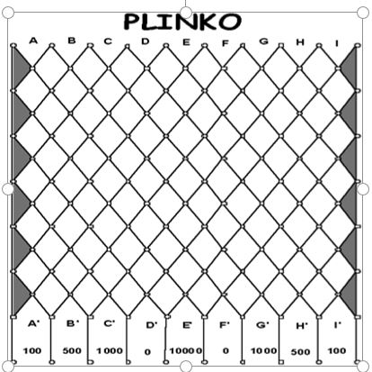
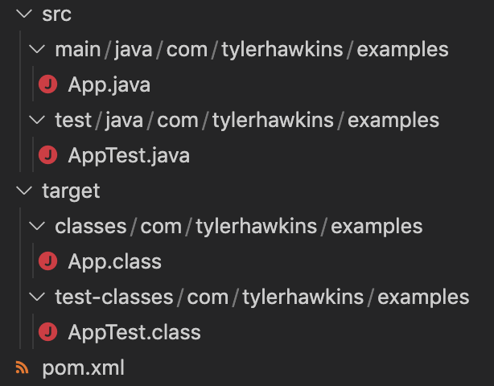

# Java Plinko

This is a Plinko game from the game show The Price Is Right built in Java. A chip is dropped from the middle slot of a 9x13 board, bounces on pegs on its way down, and then lands in one of nine buckets.

This experiment is run 10,000 times, and then the actual results are compared to the expected results based on the probability of the chip landing in each bucket. The actual results compared to the expected results are extremely close, often within less than 1% difference for each bucket.



## How This Project Was Created

1. [Install Java](https://www.oracle.com/java/technologies/downloads/#jdk18-mac)

2. Set Java environment variable in `~/.bash_profile` file:
```bash
export JAVA_HOME="/Library/Java/JavaVirtualMachines/jdk-18.jdk/Contents/Home"
```

3. Verify Java is installed by running `java -version`. Output looks like:
```
java version "18" 2022-03-22
Java(TM) SE Runtime Environment (build 18+36-2087)
Java HotSpot(TM) 64-Bit Server VM (build 18+36-2087, mixed mode, sharing)
```

4. [Download Maven](https://maven.apache.org/download.cgi)

5. Set Maven environment variables in `~/.bash_profile` file:
```bash
export MAVEN_ROOT="$HOME/Code/apache-maven-3.8.5"
export PATH="$MAVEN_ROOT/bin:$PATH"
```

6. Verify Maven is installed by running `mvn --version`. Output looks like:
```
Apache Maven 3.8.5 (3599d3414f046de2324203b78ddcf9b5e4388aa0)
Maven home: /Users/tylerhawkins/Code/apache-maven-3.8.5
Java version: 18, vendor: Oracle Corporation, runtime: /Library/Java/JavaVirtualMachines/jdk-18.jdk/Contents/Home
Default locale: en_US, platform encoding: UTF-8
OS name: "mac os x", version: "10.14.4", arch: "x86_64", family: "mac"
```

7. Generate the `plinko` project using the `maven-archetype-quickstart` plugin: 
```bash
mvn archetype:generate -DgroupId=com.tylerhawkins.examples -DartifactId=plinko -DarchetypeArtifactId=maven-archetype-quickstart -DinteractiveMode=false
```

The newly created project directory structure will look like this:


8. Add the following properties to the `pom.xml` file to specify the version of Java you'd like to use:
```xml
<properties>
  <maven.compiler.source>18</maven.compiler.source>
  <maven.compiler.target>18</maven.compiler.target>
</properties>
```

9. Rename `App.java` and `AppTest.java` files to be `PlinkoGame.java` and `PlinkoGameTest.java`

10. In the `pom.xml` file, upgrade JUnit from 3.8.1 to 4.13.2 by replacing the version number

11. Write some code to build the Plinko game!

## Build and Test the App

To build and test the app, run the following from the project root directory:

```bash
mvn clean package
```

## Run the App

To run the Plinko app, run the following from the project root directory:

```bash
java -cp target/classes com.tylerhawkins.examples.PlinkoGame
```

Alternatively, you can run the JAR file by doing:

```bash
java -cp target/plinko-1.0-SNAPSHOT.jar com.tylerhawkins.examples.PlinkoGame
```

Either approach will run the app.

The experiment results will then be output to your console and look something like this:

```
----------------------------
| Slot | Expected | Actual |
|--------------------------|
| 1    | 0.019    | 0.015  |
| 2    | 0.054    | 0.054  |
| 3    | 0.121    | 0.126  |
| 4    | 0.193    | 0.202  |
| 5    | 0.226    | 0.220  |
| 6    | 0.193    | 0.191  |
| 7    | 0.121    | 0.123  |
| 8    | 0.054    | 0.053  |
| 9    | 0.019    | 0.017  |
----------------------------
```

## Resources

- [Maven Quick Guide](https://www.tutorialspoint.com/maven/maven_quick_guide.htm)
- [Apache Maven Project](https://maven.apache.org/what-is-maven.html)
- [Maven in 5 Minutes](https://maven.apache.org/guides/getting-started/maven-in-five-minutes.html)
- [W3 Schools Java Tutorial](https://www.w3schools.com/java/default.asp)
- [Install Java SE 18 for Mac](https://www.oracle.com/java/technologies/downloads/#jdk18-mac)
- [JUnit](https://junit.org/junit5/docs/current/user-guide/)
- [Plinko](https://pressbooks.howardcc.edu/jrip3/chapter/so-you-want-to-win-plinko/)
